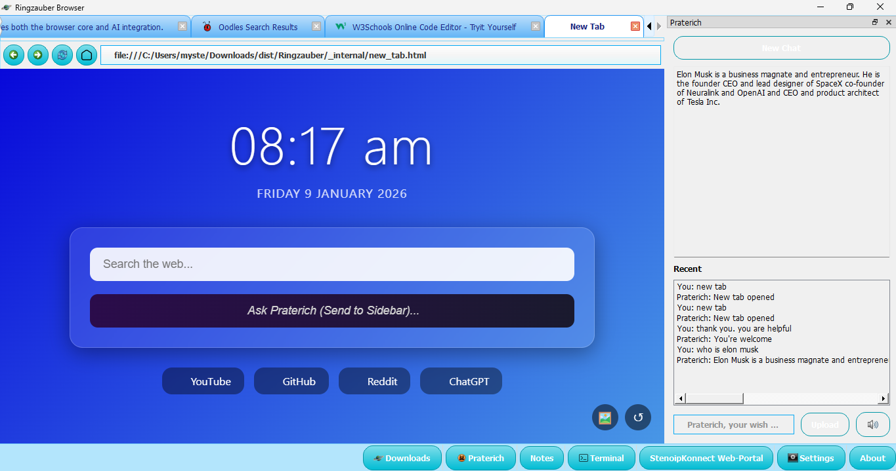

# Ringzauber Browser

**Ringzauber** is an AI-powered browser designed to enhance privacy and usability. Built with PyQt5(along with Flask and QSS), it ensures your browsing history is not saved, offering a simple and secure browsing experience. Ringzauber comes the merging of words: Ring and zauber(zauber is a Deutsch word for magic, "z" is pronouced like an "s").

Ringzauber is available for Windows 7, 8.1, 10 and 11(Please do not try on Windows Vista or 8)

## AI-Controlled Experience

At its core, Ringzauber is powered by **Praterich**, an AI assistant that can handle web navigation, search, settings adjustments and more. This intelligent assistant can help you interact with the browser in a natural, conversational way.

## Features

- **Private browsing**: No history saved
- **Cross-platform**: Windows 7, 8.1, 10 and 11(Great for if you computer still has Internet Explorer)
- **AI assistance**: Powered by **Praterich** for task automation
- **Customizable**: Adjust the theme and browser interface

## What's New in Ringzauber 1.6

Ringzauber 1.6 introduces **AI Capture**, Oodles Intregation, abilty to use camera and microphone for websites. You can know choose you favourable search engine. 
      You do not need SearXNG anymore but you may use it if you like.
        

        AI api has been switched from Gemini 2.5 Flash to Groq.

## Download

Get the latest version of Ringzauber from the following links:

- [Ringzauber Browser version 1.5 Besser](https://drive.google.com/file/d/1euOGnabj6ULBD7E1WTZaMvv1VfLI4oPy/view)
- [Ringzauber Browser 1.5 Beta](https://drive.google.com/drive/folders/1SfcprFhW9uFGJ2fGA56gEvMJdEdHo2Ml?usp=sharing)
- [Ringzauber Browser Penguin (for Chromebooks)](https://drive.google.com/file/d/1q-xV-EpmSCoKv8HiSSRfNn60GYGyJJBG/view?usp=sharing)
- [Ringzauber Browser version 1.4](https://drive.google.com/file/d/1kGswsvTJjdyueLFhQ4EkSCLPKy1i3rha/view?usp=sharing)

**Note**: Ringzauber is still in its beta phase, and certain features may not be fully functional.

## Ringzauber 1.6 

**Ringzauber 1.6** is out now! Praterich bugs have been fixed. Support for Camera, Microphone and Notifications have been added.

## Contributions

We welcome contributions to the Ringzauber project. If you'd like to help improve the browser or add new features, feel free to submit an issue or pull request.

## Links

- [Home](https://stenoip.github.io/ringzauber)
- [SearXNG Setup](https://stenoip.github.io/searxng.html)
- [Privacy Policy](https://stenoip.github.io/privacy.html)
- [Blog](https://stenoip.github.io/blog/version1.5-is-here.html)

## License

© 2025 **Stenoip Company**. All rights reserved.
